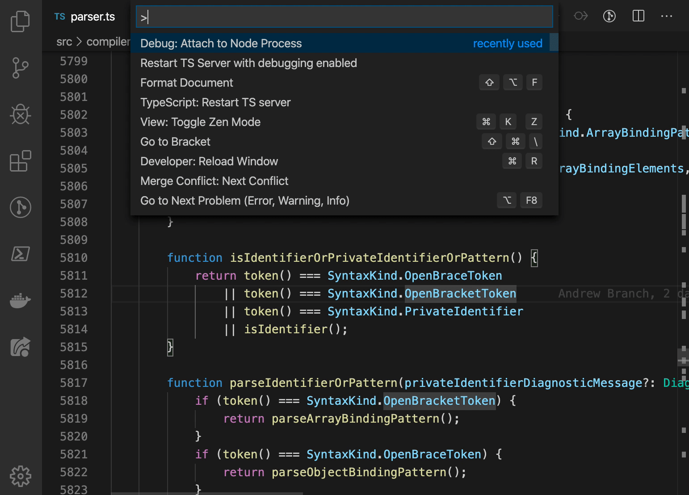

# TS Server Debug extension for VS Code

Adds a command that restarts VS Code’s TS Server process with a debug port listening. Handy for debugging language service features in a real world environment.

